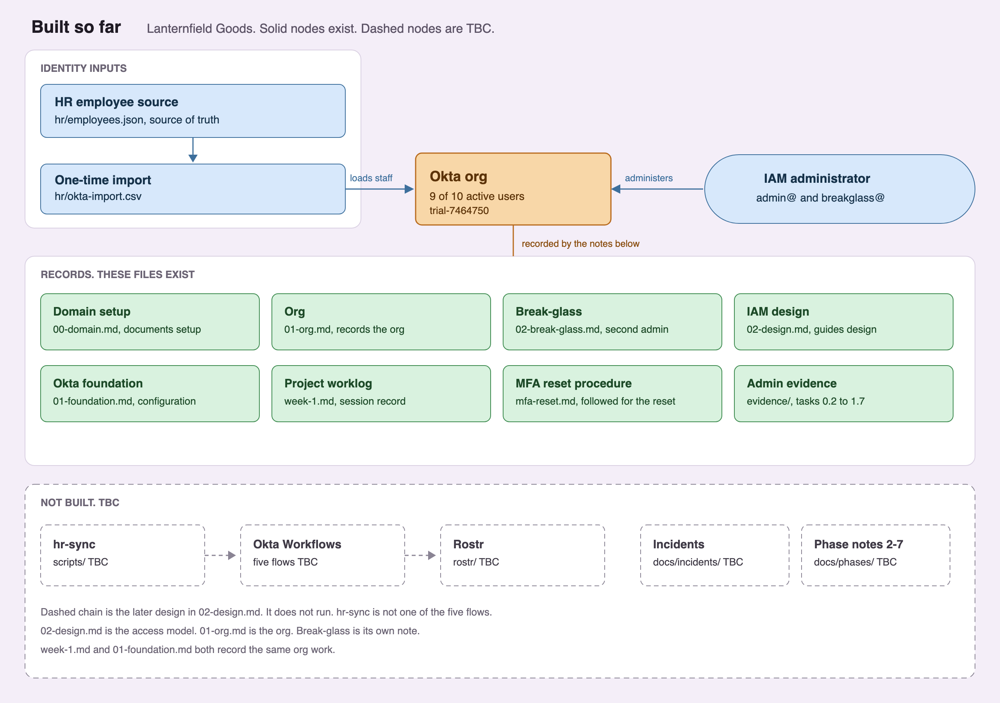

# Okta IAM Lifecycle Lab

A learning lab for Lanternfield Goods, a fictional retailer. The HR source is a JSON file in Git. Okta holds the users, groups, and policies. Rostr is the mock rostering app in `rostr/`. SAML and OIDC sign-in are in place. Okta provisions users and groups into Rostr over SCIM.

The work is day-to-day Okta administration, SaaS onboarding, joiner-mover-leaver automation, and the audit evidence those produce. It is aimed at hands-on Okta practice. About 52 hours over three weeks.

This is a learning lab, not production Okta experience. Every claim points at a file in this repository.

Code is written with AI assistance (Cursor) and reviewed by me. Okta configuration, testing, and the write-ups are done in the org and recorded here.

The domain is `lanternfieldgoods.co.uk`. The org is a 30-day Workforce Identity free trial (`trial-7464750`), not the Integrator Free Plan the design assumed. The 10-user and 5-flow budgets in the design note still apply. Lifecycle Management on this trial ends when the 30 days end.

## Where the project is

Phase 0, Phase 1, Phase 3, and Phase 4 are done. Staff are in Okta, department groups fill from rules, Okta Verify is required, and a help desk admin can reset a lost phone without changing apps or policies. Rostr answers `/health` from the container on port 3000. Jonah Hale has signed in over SAML and over OIDC. `/admin/users` requires `APP-Rostr-Admins`. Okta provisions the Rostr app over SCIM. The seven staff are in Rostr with title and department. `APP-Rostr-Users` is pushed with those seven members, and `APP-Rostr-Admins` is pushed empty. A test joiner was created, retitled, and deactivated. An account inserted straight into Rostr was imported, matched nothing, and was ignored. It is still in the Rostr database. `svc-jml-sync` can take a client-credentials token with the three API scopes, and that token can read the System Log. `scripts/hr-sync` classifies a joiner, mover, or leaver from the HR file and dry-runs unless `--apply` is passed. The Joiner flow created Thomas Okeke; group rules put him in `DEPT-Operations` and `APP-Rostr-Users`; SCIM created him in Rostr. The Mover flow moved Priya Shah to Operations and SCIM updated her title and department. The Leaver flow deactivated Samir Adeyemi; SCIM set him inactive in Rostr; a second run left him deactivated. osTicket staff login on `/scp` works (leftover itops install from 29 September; bcrypt reset recorded as an incident). Help topic Access Request exists. Lena Ortiz filed `REQ-0001` for `APP-Rostr-Admins`; the manager approval is an Internal Note. The Access Request flow added her to that group at 13:06. OIDC `/admin/users` as Lena rendered at 13:23. Rostr Admin is assigned to `APP-Rostr-Admins`. The one-hour remove was due around 14:06. Ticket `357784` is still Open. Access review REQ-0002 revoked leftover `APP-Rostr-Users` on Samir Adeyemi and `test.joiner`. Stale-Access planted Jonah Hale as stale. OAuth review found `legacy-report-tool`, revoked its grants, and deactivated it.

| Phase | Focus | Time box | Status | Where to read it |
| --- | --- | --- | --- | --- |
| 0 | Prep, domain, org, and design | 5 h | Done | [docs/decisions](docs/decisions) |
| 1 | Okta foundation | 6 h | Done | [docs/phases/01-foundation.md](docs/phases/01-foundation.md) |
| 2 | SaaS onboarding: SAML and OIDC | 8 h | In progress | [docs/phases/02-onboarding.md](docs/phases/02-onboarding.md) |
| 3 | SCIM provisioning | 8 h | Done | [docs/phases/03-scim.md](docs/phases/03-scim.md) |
| 4 | Joiner, mover, and leaver | 7 h | Done | [docs/phases/04-jml.md](docs/phases/04-jml.md) |
| 5 | Governance and audit evidence | 7.5 h | Nearly done | [docs/phases/05-governance.md](docs/phases/05-governance.md). Access review, Stale-Access, OAuth review, audit pack, and OIG mapping done. Access Request close-out waiting on Wait For. |
| 6 | Failure drills | 6 h | Not started | |
| 7 | Write-up and teardown | 4 h | Not started | Milestone M3 |

## Map of what exists

Solid nodes exist. Dashed nodes are TBC. The top row is the running path: `hr/employees.json` into `scripts/hr-sync`, into the Joiner, Mover, and Leaver flows, into Okta, into Rostr over SAML, OIDC, and SCIM. `hr/okta-import.csv` was the one-time load. Access Request close-out is waiting on Wait For. Stale-Access is a script. Phase notes 6 and 7 and the Phase 6 drills are not started. `hr-sync` is a script, not one of the five flows. The first incident record is the duplicate Rostr Admin app.

## What is in place

- Domain and catch-all mail: [docs/decisions/00-domain.md](docs/decisions/00-domain.md).
- Org, daily admin, and break-glass: [docs/decisions/01-org.md](docs/decisions/01-org.md), [docs/decisions/02-break-glass.md](docs/decisions/02-break-glass.md).
- User budget, five flows, and naming: [docs/decisions/02-design.md](docs/decisions/02-design.md).
- Seven staff, group rules, session policies, help desk role, MFA reset, and the Entra-to-Okta names: [docs/phases/01-foundation.md](docs/phases/01-foundation.md).
- Lost-phone reset: [docs/runbooks/mfa-reset.md](docs/runbooks/mfa-reset.md).
- SaaS onboarding: [docs/runbooks/saas-onboarding.md](docs/runbooks/saas-onboarding.md).
- Joiner, mover, and leaver: [docs/phases/04-jml.md](docs/phases/04-jml.md).
- Access Request grant, access review, Stale-Access, OAuth review, audit pack, OIG mapping (Access Request revoke outstanding): [docs/phases/05-governance.md](docs/phases/05-governance.md).
- OIG mapping: [docs/decisions/oig-mapping.md](docs/decisions/oig-mapping.md).
- Audit evidence pack: [evidence/audit-pack/README.md](evidence/audit-pack/README.md).

## Repository

| Path | Holds | Now |
| --- | --- | --- |
| [docs/decisions](docs/decisions) | Numbered decisions | Domain, org, break-glass, design, service identity, OIG mapping |
| [docs/phases](docs/phases) | One note per phase | [01-foundation.md](docs/phases/01-foundation.md), [02-onboarding.md](docs/phases/02-onboarding.md), [03-scim.md](docs/phases/03-scim.md), [04-jml.md](docs/phases/04-jml.md), [05-governance.md](docs/phases/05-governance.md) |
| [docs/runbooks](docs/runbooks) | Repeatable admin steps | [mfa-reset.md](docs/runbooks/mfa-reset.md), [saas-onboarding.md](docs/runbooks/saas-onboarding.md), [oauth-review.md](docs/runbooks/oauth-review.md) |
| [docs/incidents](docs/incidents) | Failure records | [00-duplicate-rostr-admin.md](docs/incidents/00-duplicate-rostr-admin.md), [01-osticket-staff-login.md](docs/incidents/01-osticket-staff-login.md). Phase 6 drills are not started |
| [docs/worklog](docs/worklog) | Session log | [week-1.md](docs/worklog/week-1.md) |
| [evidence](evidence) | Screenshots and log extracts | Tasks 0.2 through 2.7, 3.2 through 3.7, 4.1 through 4.6, 5.1 osTicket, 5.2 grant plus OIDC, 5.3 access review, 5.4 stale-access, 5.5 oauth-review, audit-pack |
| [hr](hr) | HR source of truth | [employees.json](hr/employees.json). [okta-import.csv](hr/okta-import.csv) was the one-time load |
| [rostr](rostr) | Mock SaaS app | SAML and OIDC sign-in. SCIM Users and Groups. Okta pushes users and the two `APP-Rostr` groups |
| [scripts](scripts) | Test scripts, `hr-sync`, and review exports | [scim-tests.sh](scripts/scim-tests.sh), [hr-sync](scripts/hr-sync), [entitlements.js](scripts/entitlements.js), [access-review](scripts/access-review), [stale-access](scripts/stale-access), [oauth-review](scripts/oauth-review), [audit-log-export.js](scripts/audit-log-export.js) |
| [.env.example](.env.example) | Placeholder names only | No secrets |
