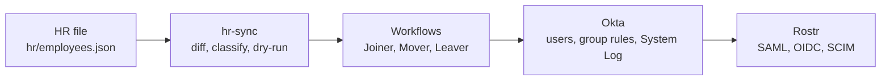

# Okta IAM Lifecycle Lab

A learning lab for Lanternfield Goods, a fictional retailer. The HR source is a JSON file in Git. Okta holds the users, groups, and policies. Rostr is the mock rostering app in `rostr/`. SAML and OIDC sign-in are in place. Okta provisions users and groups into Rostr over SCIM.

The work is day-to-day Okta administration, SaaS onboarding, joiner-mover-leaver automation, and the audit evidence those produce. It is aimed at hands-on Okta practice. About 52 hours over three weeks.

This is a learning lab, not production Okta experience. Every claim points at a file in this repository.

Code is written with AI assistance (Cursor) and reviewed by me. Okta configuration, testing, and the write-ups are done in the org and recorded here.

The domain is `lanternfieldgoods.co.uk`. The org is a 30-day Workforce Identity free trial (`trial-7464750`), not the Integrator Free Plan the design assumed. The 10-user and 5-flow budgets in the design note still apply. Lifecycle Management on this trial ends when the 30 days end.

## Where the project is

The documented lab is done. It took three days, 5 October through 7 October. osTicket ticket `357784` is Closed. The report and the three practice accounts are written for a reader who was not in the lab. The trial org is still up. Teardown was not run.

The HR file is ahead of the Phase 4 story. Jonah Hale and Priya Shah are in Operations. Samir Adeyemi and Thomas Okeke are terminated. Marcus Bell and Ava Nguyen were added to `APP-Rostr-Admins` by hand for the stretch below. An orphan row in Rostr was imported, matched nobody, and ignored. The finished account is [docs/report.md](docs/report.md).

## Stretch: leave hub

A staff member will sign in to Rostr and ask for leave. [Jev](docs/decisions/jev-02-decision-model.md), a TypeSafe decision model, reads the request and recommends approve, deny, or needs review. It does not make the decision. Code checks the hard rules. A department admin approves first, then HR. Okta groups decide who sees which screen. No new Okta user and no new Workflow.

| Group | Who, so far | Screen, once it exists |
| --- | --- | --- |
| `APP-Rostr-Users` | Staff already in it by rule | Their own requests |
| `APP-Rostr-Admins` | Marcus Bell, Ava Nguyen | Pending requests in their department |
| `APP-Rostr-HR` | Helen Cho | Final sign-off for every department |

Phase 1 is done: those groups, the existing `groups` claim (it already matches `APP-Rostr-HR`), and the TypeSafe key in `rostr/.env`. The value is not in Git. [docs/leave/01-okta.md](docs/leave/01-okta.md). Phase 2 stores leave balances in the HR file and the request tables in Rostr. [docs/leave/02-data.md](docs/leave/02-data.md). Phase 3 routes a signed-in person to one hub from their Okta groups. [docs/leave/03-shell.md](docs/leave/03-shell.md). Priya Shah can open the SAML app and the staff hub at `/leave`. Marcus Bell reached the admin hub and Helen Cho reached the HR hub. Helen's `/me` role line still says staff. The hub badge says HR. The sign-on policy had required FastPass, and her directory password had already been reset. [docs/incidents/08-rostr-sign-on.md](docs/incidents/08-rostr-sign-on.md). The leave forms are not built. Phases that need a live Okta sign-in have to land before the trial ends around 4 November 2026.

| Phase | Focus | Time box | Status | Where to read it |
| --- | --- | --- | --- | --- |
| 0 | Prep, domain, org, and design | 5 h | Done | [docs/decisions](docs/decisions) |
| 1 | Okta foundation | 6 h | Done | [docs/phases/01-foundation.md](docs/phases/01-foundation.md) |
| 2 | SaaS onboarding: SAML and OIDC | 8 h | Done | [docs/phases/02-onboarding.md](docs/phases/02-onboarding.md) |
| 3 | SCIM provisioning | 8 h | Done | [docs/phases/03-scim.md](docs/phases/03-scim.md) |
| 4 | Joiner, mover, and leaver | 7 h | Done | [docs/phases/04-jml.md](docs/phases/04-jml.md) |
| 5 | Governance and audit evidence | 7.5 h | Done | [docs/phases/05-governance.md](docs/phases/05-governance.md). Ticket `357784` is Closed. |
| 6 | Failure drills | 6 h | Done | [docs/incidents/02-saml-acs.md](docs/incidents/02-saml-acs.md) through [docs/incidents/07-leaver-downstream.md](docs/incidents/07-leaver-downstream.md) |
| 7 | Write-up and teardown | 4 h | Done | [docs/report.md](docs/report.md) and [docs/interview-stories.md](docs/interview-stories.md). The org was not torn down. |

## Data flow

An HR change is the only manual step on this path. Okta and Rostr follow. Access Request joins at Okta from a ticket. Stale-Access is a script. It reads Rostr and the HR file and does not sit on this arrow.




Every node is built. The top row is the path above. `hr/okta-import.csv` was the one-time load. `hr-sync` is a script, not one of the Workflows. Teardown is not on this diagram.

## Run Rostr locally

Docker is required. From `rostr/`:

```bash
docker compose up -d --build
```

Do not pass `-v`. That deletes the database volume. `http://127.0.0.1:3000/health` returns the text `OK`.

`rostr/.env` is not in Git. Compose refuses to start without these names set: `SESSION_SECRET`, `OIDC_ISSUER`, `OIDC_CLIENT_ID`, `OIDC_CLIENT_SECRET`, `SCIM_TOKEN`. `OKTA_SAML_METADATA_URL` and `ROSTR_BASE_URL` are also read. `ROSTR_BASE_URL` defaults to `https://rostr.lanternfieldgoods.co.uk`. Copy the names from [.env.example](.env.example) for the scripts; the Rostr process reads `rostr/.env`, not the root file.

The public hostname needs the tunnel. Credentials and `config.yml` stay in `~/.cloudflared/`. The tunnel name is `rostr`. It sends `rostr.lanternfieldgoods.co.uk` to `http://localhost:3000`.

```bash
cloudflared tunnel run rostr
```

`npm test` in `rostr/` runs the unit tests. It does not need the tunnel.

## Read it in order

Each numbered file links to the one before it. The decisions use this order, including the two files numbered 02.

1. [docs/decisions/00-domain.md](docs/decisions/00-domain.md)
2. [docs/decisions/01-org.md](docs/decisions/01-org.md)
3. [docs/decisions/02-break-glass.md](docs/decisions/02-break-glass.md)
4. [docs/decisions/02-design.md](docs/decisions/02-design.md)
5. [docs/decisions/scripts-identity.md](docs/decisions/scripts-identity.md)
6. [docs/phases/01-foundation.md](docs/phases/01-foundation.md)
7. [docs/phases/02-onboarding.md](docs/phases/02-onboarding.md)
8. [docs/phases/03-scim.md](docs/phases/03-scim.md)
9. [docs/phases/04-jml.md](docs/phases/04-jml.md)
10. [docs/phases/05-governance.md](docs/phases/05-governance.md)
11. [docs/decisions/oig-mapping.md](docs/decisions/oig-mapping.md)
12. [docs/incidents/00-duplicate-rostr-admin.md](docs/incidents/00-duplicate-rostr-admin.md) through [docs/incidents/08-rostr-sign-on.md](docs/incidents/08-rostr-sign-on.md)
13. [docs/report.md](docs/report.md)
14. [docs/interview-stories.md](docs/interview-stories.md)

## What is in place

- Domain and catch-all mail: [docs/decisions/00-domain.md](docs/decisions/00-domain.md).
- Org, daily admin, and break-glass: [docs/decisions/01-org.md](docs/decisions/01-org.md), [docs/decisions/02-break-glass.md](docs/decisions/02-break-glass.md).
- User budget, five flows, and naming: [docs/decisions/02-design.md](docs/decisions/02-design.md).
- Seven staff, group rules, session policies, help desk role, MFA reset, and the Entra-to-Okta names: [docs/phases/01-foundation.md](docs/phases/01-foundation.md).
- Lost-phone reset: [docs/runbooks/mfa-reset.md](docs/runbooks/mfa-reset.md).
- SaaS onboarding: [docs/runbooks/saas-onboarding.md](docs/runbooks/saas-onboarding.md).
- Joiner, mover, and leaver: [docs/phases/04-jml.md](docs/phases/04-jml.md).
- Access Request grant and automatic remove, access review, Stale-Access, OAuth review, audit pack, OIG mapping. Ticket `357784` is Closed: [docs/phases/05-governance.md](docs/phases/05-governance.md).
- Six failure drills: [docs/incidents/02-saml-acs.md](docs/incidents/02-saml-acs.md) through [docs/incidents/07-leaver-downstream.md](docs/incidents/07-leaver-downstream.md). A later sign-in failure is [docs/incidents/08-rostr-sign-on.md](docs/incidents/08-rostr-sign-on.md).
- Lab report: [docs/report.md](docs/report.md). The PDF export is [okta-iam-lifecycle-lab-report.pdf](okta-iam-lifecycle-lab-report.pdf).
- Three practice accounts: [docs/interview-stories.md](docs/interview-stories.md). The PDF export is [okta-iam-interview-stories.pdf](okta-iam-interview-stories.pdf).

## Repository

| Path | Holds | Now |
| --- | --- | --- |
| [docs/decisions](docs/decisions) | Numbered decisions | Domain, org, break-glass, design, service identity, OIG mapping |
| [docs/phases](docs/phases) | One note per phase | [01](docs/phases/01-foundation.md) through [05](docs/phases/05-governance.md) |
| [docs/runbooks](docs/runbooks) | Repeatable admin steps | [mfa-reset.md](docs/runbooks/mfa-reset.md), [saas-onboarding.md](docs/runbooks/saas-onboarding.md), [oauth-review.md](docs/runbooks/oauth-review.md) |
| [docs/incidents](docs/incidents) | Failure records | [00](docs/incidents/00-duplicate-rostr-admin.md) through [08](docs/incidents/08-rostr-sign-on.md) |
| [docs/worklog](docs/worklog) | Session log | [week-1.md](docs/worklog/week-1.md) |
| [evidence](evidence) | Screenshots and log extracts | Tasks 0.2 through 6.6, plus the audit pack |
| [hr](hr) | HR source of truth | [employees.json](hr/employees.json). [okta-import.csv](hr/okta-import.csv) was the one-time load |
| [rostr](rostr) | Mock SaaS app | SAML and OIDC sign-in. SCIM Users and Groups. Okta pushes users and the two `APP-Rostr` groups |
| [scripts](scripts) | Test scripts, `hr-sync`, and review exports | [scim-tests.sh](scripts/scim-tests.sh), [hr-sync](scripts/hr-sync), [entitlements.js](scripts/entitlements.js), [access-review](scripts/access-review), [stale-access](scripts/stale-access), [oauth-review](scripts/oauth-review), [audit-log-export.js](scripts/audit-log-export.js) |
| [.env.example](.env.example) | Placeholder names only | No secrets |
