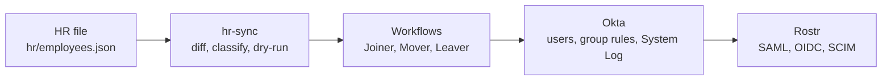

# 02 — Design

Decision date: 2026-10-06

The org allows 10 active users and 5 Workflows. Deactivated users do not count. This note spends both budgets before anything else is built. Addresses are the `.co.uk` plan in [00-domain.md](00-domain.md).

## User budget

| Slot | Count | Who | Where it goes |
| --- | --- | --- | --- |
| Daily admin | 1 | `admin@lanternfieldgoods.co.uk` | Okta sign-in and day-to-day administration. Already active. |
| Break-glass | 1 | `breakglass@lanternfieldgoods.co.uk` | Super Organization Administrator, used only when the daily admin is locked out. Already active. See [02-break-glass.md](02-break-glass.md). |
| Staff | 7 | `hr/employees.json` | Loaded into Okta in task 1.2. Sales 3, Operations 2, Finance 2. |
| Joiner tests | 1 | Empty until Phase 4 | The only free slot while all seven staff are active. One test joiner fills the org to 10. |
| Total | 10 | | |

Two slots are used. Seven are reserved for the HR file. One stays empty.

A leaver is deactivated, which returns a slot. A second joiner is allowed only after that, or after the test joiner is deactivated. No eighth employee is added to the HR file while the spare slot is the joiner test.

## Flow budget

Five Workflows. No helper flow. A sixth automation is a script, not a flow.

| Flow | Trigger | What it does | What it must not do |
| --- | --- | --- | --- |
| Joiner | `hr-sync` calls an API endpoint when an `employeeId` is new | Create and activate the Okta user from the HR fields. Group rules then add the `DEPT-` group and `APP-Rostr-Users`. SCIM creates the user in Rostr. | Assign groups or apps inside the flow. |
| Mover | `hr-sync` calls an API endpoint when department, title, or `managerId` changes | Update the Okta profile. Group rules move the `DEPT-` group. Remove any individual app assignment left on the user. | Leave the old department group or an individual assignment in place. |
| Leaver | `hr-sync` calls an API endpoint when `status` is `terminated` or `endDate` has passed | Clear sessions, then deactivate. SCIM sets the Rostr user inactive. A second run does nothing harmful. | Delete the Okta user. Deactivation is what frees the slot. |
| Access Request | osTicket topic Access Request, after the HR manager approves. API endpoint, not the HR file. | Add the user to `APP-Rostr-Admins`, wait one hour, then remove them. First ticket is `REQ-0001`. | Grant the app to the user directly. |
| Stale-Access | Daily schedule | List Rostr users with no sign-in for 30 days, and compare Rostr seats with active staff in the HR file. | Change the HR file or deactivate users by itself. |

Joiner, Mover, and Leaver are the only flows on the HR path. Access Request starts from a ticket. Stale-Access starts from the clock and reads Rostr and the HR file.

`hr-sync` is a script. It diffs `hr/employees.json` against the previous Git version, classifies the change, and dry-runs unless `--apply` is passed. It is not one of the five flows. The access-review export is also a script.

## Naming

| Object | Pattern | This lab | Rule |
| --- | --- | --- | --- |
| Department group | `DEPT-{name}` | `DEPT-Sales`, `DEPT-Operations`, `DEPT-Finance` | Filled by a group rule on `department`. Never assigned by hand. |
| App access group | `APP-{app}-{role}` | `APP-Rostr-Users`, `APP-Rostr-Admins` | The only way an app is assigned. No individual assignments. A user in any `DEPT-` group is put in `APP-Rostr-Users` by a rule. |
| Admin group | `ADM-{scope}` | `ADM-Helpdesk` | Holds an admin role. Membership only through an approved request. |
| Automation identity | `svc-{purpose}` | `svc-jml-sync` | OAuth service app, private key kept out of Git. Scopes: `okta.users.manage`, `okta.groups.manage`, `okta.logs.read`. |
| Ticket | `REQ-####` or `INC-####` | `REQ-0001` for the first access request | `hr-sync` rejects a ticket that does not match `REQ-` plus four digits. |

## Address plan

| Address | Used for |
| --- | --- |
| `admin@lanternfieldgoods.co.uk` | Daily admin |
| `breakglass@lanternfieldgoods.co.uk` | Break-glass |
| `it@lanternfieldgoods.co.uk` | Service desk, osTicket, fallback Okta sign-up |
| `firstname.lastname@lanternfieldgoods.co.uk` | The seven staff and the joiner. Catch-all, not a rule per person |
| `rostr.lanternfieldgoods.co.uk` | Rostr's HTTPS hostname. Not an email address |

## Data flow

An HR change is the only manual step on this path. Okta and Rostr follow.

Access Request joins at Okta from an approved ticket, not from `hr-sync`. Stale-Access reads Rostr and the HR file on a schedule and writes a finding. It does not sit on this arrow.

## Out of scope

- **Device trust.** It needs managed devices. It is a known gap, not a build.
- **A real HRIS.** The HR system is `hr/employees.json` in Git. No Workday, BambooHR, or other connector.
- **Okta Identity Governance.** Not in this plan. Requests and reviews are osTicket, Workflows, and the API. The product is read and mapped later. That mapping is not an audit opinion and is not a compliance claim.
- **Production data.** Staff are fictional. This org is a lab. Nothing from a real employer goes in the HR file, Okta, or Rostr.
