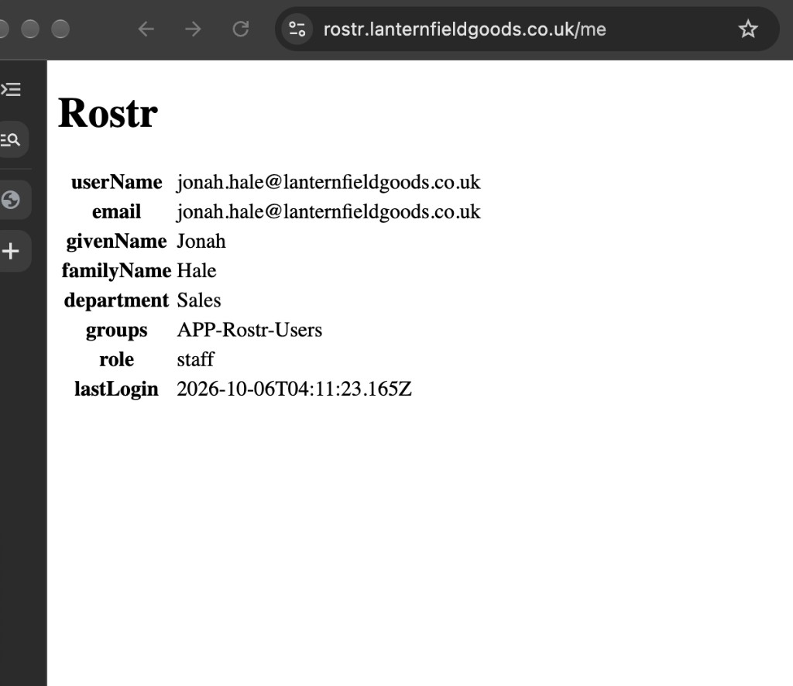
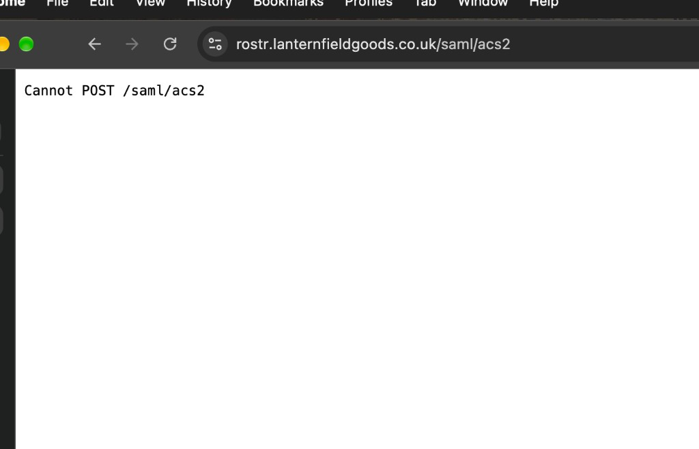
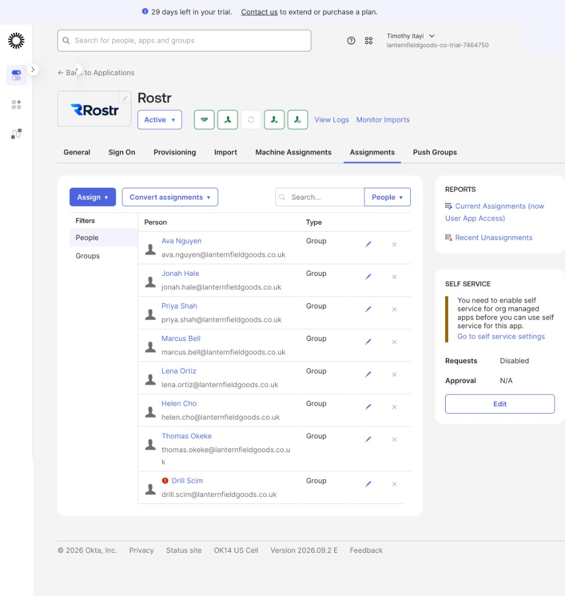
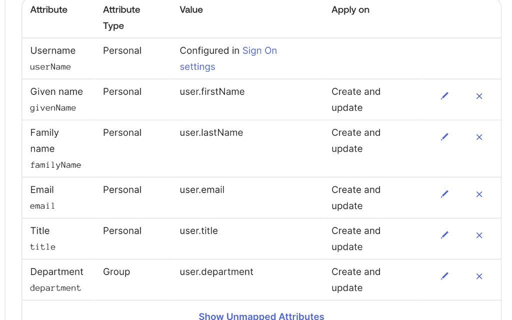

# Lanternfield Goods — three accounts from the lab

Previous: [Okta IAM lab report](report.md).

Date: 2026-10-07. These are three accounts from a learning lab, written so someone who was not in the lab can follow them. They are not a claim of production Okta administration. The lab report, with the people and the short definitions, is [docs/report.md](report.md). Each "two-minute account" below is the version to read aloud.

Rostr is the mock rostering app. Okta is the directory. A SAML sign-in is Okta posting a signed message to Rostr. SCIM is the separate API Okta uses to create and update the account inside Rostr. A mover is a department or job change. A group rule fills a group from the person's profile. A membership added by hand does not move when the department changes.

## 1. A SAML assertion

This is the staff sign-in. The person is Jonah Hale, a fictional salesperson. The app starts the login. Okta posts the signed message to `/saml/acs`, which is the only address Rostr accepts it on. The full record is [docs/phases/02-onboarding.md](phases/02-onboarding.md). An annotated copy of the raw message was not saved. The account uses the settings, Jonah's signed-in page, the auth log, and a later drill where that address was pointed at the wrong path.

| Field | What this lab used |
| --- | --- |
| Start | `GET /saml/login` on `https://rostr.lanternfieldgoods.co.uk` |
| ACS, recipient, destination | `https://rostr.lanternfieldgoods.co.uk/saml/acs` |
| Audience | `https://rostr.lanternfieldgoods.co.uk/saml/metadata` |
| NameID | Email address |
| Issuer | `http://www.okta.com/exk18eddmjojhjW6v698`. The scheme is `http`. Rostr copies it from the metadata. |
| Signature | Assertion must be signed. The certificate comes from the metadata. An unsigned POST to the ACS returned 401, reason `Invalid document signature`. |
| Attributes | `email`, `firstName`, `lastName`, `department`, each a profile value |
| Groups | One statement, name `groups`, filter starts with `APP-Rostr` |
| Assignment | The SAML app is assigned to `APP-Rostr-Users`, not to individual people |

Jonah Hale signed in on 6 October. `/me` showed username `jonah.hale@lanternfieldgoods.co.uk`, department Sales, groups `APP-Rostr-Users`, role staff. The role is not a SAML attribute. Rostr sets staff unless `groups` contains `APP-Rostr-Admins`. The auth log line at `2026-10-06T04:11:23.173Z` is `protocol` `saml`, that user, `outcome` `success`. Sign-in wrote name, email, department, and last login. It did not write title or `active`. Those belong to SCIM.

Drill 6.1 is the destination check. The single sign-on URL was changed to `/saml/acs2`, and recipient and destination followed it. Okta still accepted Jonah. The browser stopped on `Cannot POST /saml/acs2`. `logs/rostr-auth.jsonl` gained no line, because the POST never reached the SAML handler. [docs/incidents/02-saml-acs.md](incidents/02-saml-acs.md).

### Two-minute account

Rostr is a small app I built for a learning lab. Staff sign in with SAML. The app starts the login. A browser opens `https://rostr.lanternfieldgoods.co.uk/saml/login`, Rostr redirects to Okta with a SAML request, and Okta posts the response back to `/saml/acs`.

The audience is `https://rostr.lanternfieldgoods.co.uk/saml/metadata`. Recipient and destination are the ACS URL. The NameID is email. Okta's issuer uses `http`, not `https`. Rostr copies that string and the signing certificate from the metadata. An unsigned POST to the ACS returned 401, logged as an invalid document signature. A failed response is not trusted for a username.

The attribute statements are plain profile values: email, first name, last name, and department. There is one group statement, named groups, filtered to names that start with `APP-Rostr`. The app is assigned to the group `APP-Rostr-Users`, not to people.

Jonah Hale signed in on 6 October. `/me` showed his email as the username, department Sales, groups `APP-Rostr-Users`, and role staff. The role is not a SAML attribute. Rostr sets staff unless that groups value contains `APP-Rostr-Admins`. The auth log has one success line for that sign-in. Sign-in wrote his name, email, department, and last login. It did not write title or the active flag. Those belong to SCIM.

I do not have an annotated raw assertion saved. What I can show is the metadata, the ACS behaviour, the `/me` page, and the log line. The failure that taught me the destination field was a deliberate drill. I pointed the single sign-on URL at `/saml/acs2`, with recipient and destination following it. Okta still accepted Jonah. The browser then stopped on `Cannot POST /saml/acs2`, and the auth log gained no line, because the request never reached the SAML handler.

## 2. A mover with no leftover access

This is a department change that did not leave the old access behind. Priya Shah moved from Sales to Operations on 6 October. Her old department group was removed, the new one was added, and her access to Rostr stayed because that access comes from "any department," not from Sales. Nothing on her account had been granted by hand. The record is [docs/phases/04-jml.md](phases/04-jml.md). The before and after lists are [evidence/04-jml/before.csv](../evidence/04-jml/before.csv) and [evidence/04-jml/after.csv](../evidence/04-jml/after.csv). No row in either file was added by hand.

| Step | What landed |
| --- | --- |
| HR change | Department Operations, title Operations Analyst, manager Marcus Bell, EMP-1004. `hr-sync` dry-ran one mover. |
| Okta profile | `user.account.update_profile` at `2026-10-06T14:41:06.052Z` |
| Groups | `DEPT-Sales` removed and `DEPT-Operations` added in that same second. `APP-Rostr-Users` stayed, because that rule is any department group. |
| Rostr | SCIM `PUT` at `14:41:07.509Z`, id `7c6e64c3-b1b4-4e29-a0c6-d475e1006f43`, title Operations Analyst, department Operations, `active` true |
| The 504 | `--apply` for REQ-0006 returned HTTP 504 after about 61 seconds. The Mover flow waits 60 seconds. The profile and the PUT had already landed. `logs/jml.csv` has no REQ-0006 row, because the script writes that file only after HTTP 200. The apply was not run again. |

The later move of Jonah Hale is the boundary of this account. He had been added to `APP-Rostr-Admins` by hand. The department rules moved him to Operations and left that membership in place. The mover does not remove a grant it did not create. Priya's move is clean because every group on her account came from a rule. [docs/incidents/06-mover-residue.md](incidents/06-mover-residue.md).

### Two-minute account

Priya Shah moved from Sales to Operations. The only input was a change in `hr/employees.json`: department, title to Operations Analyst, and manager to Marcus Bell. `scripts/hr-sync` diffs that file against the previous commit and does nothing unless I pass `--apply`. The dry-run was one mover.

The Mover flow updates the Okta profile and then waits sixty seconds, long enough for the group rules to run. At 14:41 UTC the profile update and the group change are in the same second. `DEPT-Sales` came off. `DEPT-Operations` went on. She stayed in `APP-Rostr-Users`, because that group is a rule on any department group, not a rule on Sales. One second later Okta sent a SCIM PUT to Rostr. Same user id. Title Operations Analyst, department Operations, active still true. No new account, and no deactivation.

The apply call returned HTTP 504 after about sixty-one seconds. That is the wait card outlasting the script. The profile and the PUT had already landed. `logs/jml.csv` has no row for that ticket, because the script only writes the row after a 200. I did not run it again.

The entitlements export before and after is the check for leftover access. Before, Priya is in `DEPT-Sales`. After, she is in `DEPT-Operations`. No row in either file has source `individual`. Every group she kept came from a rule. That is the condition. When I later moved Jonah and he had been put in `APP-Rostr-Admins` by hand, that membership stayed. The mover does not remove a grant it did not create. Priya's move is clean because there was nothing on her account except rules.

## 3. The provisioning incident

This is a created account that Okta reported as successful while the department never arrived. Drill Scim is a throwaway user, not an employee. Rostr was temporarily set to reject a new account that had no department, and the Okta mapping that sends department was removed. His Okta profile still said Sales. The group rule put him in the Rostr users group, so Okta tried to create him in the app. The record is [docs/incidents/05-scim-mapping.md](incidents/05-scim-mapping.md). The refusal was only on the running app. The code in Git does not contain it.

| Call | Time | Result |
| --- | --- | --- |
| `POST /scim/v2/Users` | `2026-10-07T06:44:14.139Z` | 400, `department is required`. Body had name and email. No enterprise department. Okta user `00u18gcp8vmAocAtp698`. |
| System Log | `06:44:14.247Z` | `application.provision.user.push` FAILURE. Bad request, department is required. |
| `POST /scim/v2/Users` | `07:00:21.831Z` | 201, Rostr id `e4aaf631-250f-4fe8-b8c0-3df1394665f2`. Same body. No department. Okta logged SUCCESS. |
| `PUT` after a title edit | `07:06:38.644Z` | 200. Title `Drill`. Enterprise department `Sales`. |
| `PUT` on deactivate | `07:07:31.523Z` | 200. `active` false. Title and department kept. |

His Okta profile was Sales the whole time. The first body omitted department because the mapping was gone. The mapping was then set back to `user.department`, create and update. The retry still omitted it. Okta treated the 201 as a successful push and the Assignments row went quiet. A retry of that failed create did not re-read the mapping. The profile edit is the write that carried the attribute.

### Two-minute account

I made Rostr refuse a SCIM create that arrived without a department, and I removed the department mapping in Okta. Then I created a throwaway user, Drill Scim, with department Sales. The group rule put him in `APP-Rostr-Users`, which is what makes Okta try to create him in Rostr.

The symptom in Okta was a red mark on his assignment. The System Log said the push failed: bad request, department is required. Rostr's log at 06:44 UTC is the cause. `POST /scim/v2/Users` returned 400. The body had his name and email. The schemas list was only the core user. There was no enterprise department. His Okta profile still said Sales. The mapping was what had been removed, not the profile value.

I put the mapping back as `user.department`, create and update, and retried the assignment. Okta logged the push as success. Rostr returned 201 and created the user. The request body was the same as the failed one. Still no department. The Assignments tab went quiet because the status code was 201. Okta does not check that a mapped attribute was in the body. A retry of that failed create did not re-read the mapping I had just saved.

The push that actually carried department was a later profile edit. I set his title to Drill and left department as Sales. Okta sent a PUT. Title Drill, enterprise department Sales. I then deactivated him. A second PUT set active to false and kept the title and the department. The lesson I would use on a real ticket is: the green assignment means the app returned success. The app log is where you check the attribute.
