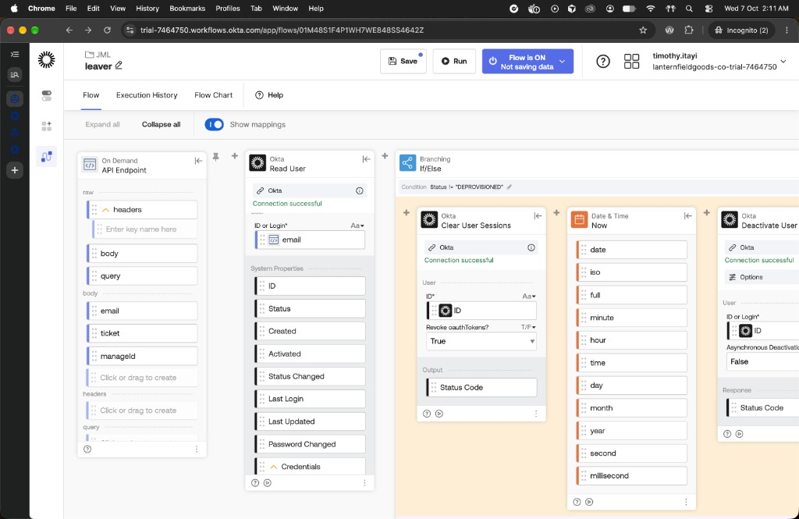
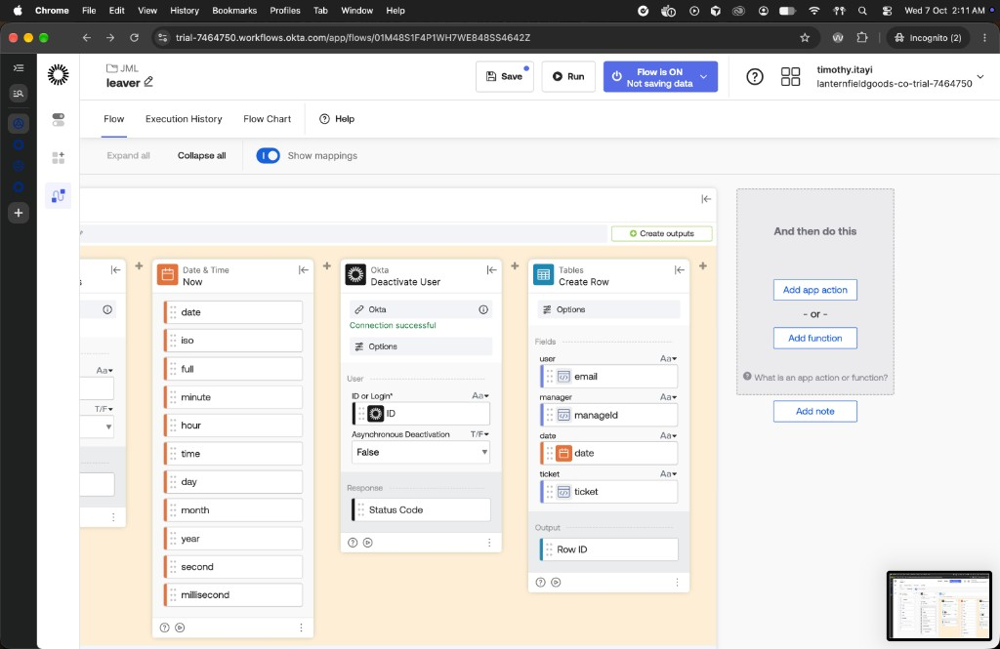

# Phase 4 — Joiner, mover, and leaver

Previous: [Phase 3 — SCIM provisioning](03-scim.md).

An HR change created Thomas Okeke, moved Priya Shah from Sales to Operations, and deactivated Samir Adeyemi. Group rules filled access. SCIM created Thomas in Rostr, updated Priya, and set Samir inactive. A second Leaver run on Samir did nothing further.

The comparison is [evidence/04-jml/comparison.md](../../evidence/04-jml/comparison.md). Before: [evidence/04-jml/before.csv](../../evidence/04-jml/before.csv). After: [evidence/04-jml/after.csv](../../evidence/04-jml/after.csv).

## 4.1 Automation identity

`svc-jml-sync` is the API service app. Client id `0oa18eu8qpmkJBqdg698`, key id `svc-jml-sync-1`, private key outside the repo. Scopes are `okta.users.manage`, `okta.groups.manage`, and `okta.logs.read`. The org requires DPoP. Record: [docs/decisions/scripts-identity.md](../decisions/scripts-identity.md).

## 4.2 hr-sync

`scripts/hr-sync` diffs `hr/employees.json` against `HEAD~1`. A new id is a joiner. A change of department, title, or `managerId` is a mover. `status` terminated, or an `endDate` on or before today in Sydney, is a leaver, and that wins over a mover on the same person. Dry-run is the default and requires `REQ-####`. `--apply` posts each event and then appends `logs/jml.csv`.

Each API Endpoint card has its own client token. The script sends `WORKFLOWS_JOINER_TOKEN`, `WORKFLOWS_MOVER_TOKEN`, or `WORKFLOWS_LEAVER_TOKEN` when that name is set, and otherwise `WORKFLOWS_CLIENT_TOKEN`. The URL in `.env` is the invoke URL ending at `/invoke`.

## 4.3 Joiner

Thomas Okeke, `thomas.okeke@lanternfieldgoods.co.uk`, Operations, `Operations Coordinator`, manager `EMP-1004`. REQ-0004 created him Active. Group rules put him in `DEPT-Operations` and `APP-Rostr-Users`. Nothing was assigned by hand.

| Step | Time | Evidence |
| --- | --- | --- |
| `hr-sync` logged the event | `13:35:58.761Z` | `logs/jml.csv`, `REQ-0004,joiner,EMP-1008` |
| Okta looked for him in Rostr | `13:35:59.650Z` | `GET /scim/v2/Users`, `totalResults` 0 |
| Okta created him | `13:35:59.943Z` | `POST /scim/v2/Users` 201, Rostr id `bd5b32ef-eccb-4b1a-af38-fdae04c82da1` |
| Group push | `13:36:04.077Z` | `PUT` `APP-Rostr-Users`, 8 members |

Every row on the Rostr app Assignments tab is Type Group: [evidence/4.3-rostr-assignments-group.png](../../evidence/4.3-rostr-assignments-group.png). His dashboard shows the Rostr tile: [evidence/4.3-thomas-okeke-dashboard.png](../../evidence/4.3-thomas-okeke-dashboard.png). He has not signed in to Rostr.

The first apply, REQ-0003, used department `HR` and Activate False. That user was Staged, had no `DEPT-` group, and SCIM was not called. He was deleted before REQ-0004. `logs/jml.csv` still has both joiner rows for EMP-1008.

## 4.4 Mover

Priya Shah, EMP-1003, moved from Sales to Operations. Title became `Operations Analyst`. Manager became `EMP-1004`. She stayed `ACTIVE` and stayed in `APP-Rostr-Users`.

| Event | Time |
| --- | --- |
| `user.account.update_profile` | `14:41:06.052Z` |
| `DEPT-Sales` removed, `DEPT-Operations` added | `14:41:06Z` |
| SCIM `PUT` title `Operations Analyst`, department `Operations`, `active` true | `14:41:07.509Z`, Rostr id `7c6e64c3-b1b4-4e29-a0c6-d475e1006f43` |

`node scripts/hr-sync --ticket REQ-0006 --apply` then returned HTTP 504 after about 61 seconds. The Mover flow's Wait For card is 60 seconds. The profile and SCIM update above had already landed. `logs/jml.csv` has no REQ-0006 row, because the script writes that file only after every post returns OK. The same second has `user.account.update_password` for Priya. The hr-sync body has no password.

## 4.5 Leaver

Samir Adeyemi, EMP-1007, was deactivated. Okta status is `DEPROVISIONED`. Rostr `active` is 0. The active user count went from 10 to 9. A second run on the same user returned HTTP 200 and changed nothing.

The saved flow is in the `JML` folder. Read User is on the main line. The branch tests that card's `Status` output, not equal to `DEPROVISIONED`. **Run when FALSE** is empty.

Inside **Run when TRUE**, left to right: Clear User Sessions, Date & Time Now, Deactivate User, Create Row. Both Okta cards take the Read User `ID`. Revoke OAuth tokens is True. Asynchronous deactivation is False. Create Row writes the `Leaver handover` table: `user` is `email`, `manager` is `managerId`, `date` is the Now card's `date` output, `ticket` is `ticket`. `email`, `managerId`, and `ticket` are body fields on the API Endpoint.

The flow was saved at `15:11:23.127Z`. A direct call with Samir's email and `REQ-0006` returned HTTP 200 in 3.6 seconds.

| Event | Time |
| --- | --- |
| `user.session.clear` | `15:12:12.341Z` |
| `application.user_membership.remove`, Rostr | `15:12:13.535Z` |
| `user.lifecycle.deactivate` SUCCESS | `15:12:13.550Z` |
| `user.session.clear` | `15:12:13.587Z` |
| SCIM `PUT` `active` false, Rostr id `3b9b6859-19a1-4f1c-abed-92e04406b470` | `15:12:22.899Z` |

The second call returned HTTP 200 in 1.4 seconds. No new System Log event. No new SCIM line. He stayed `DEPROVISIONED`. Rostr stayed `active` 0.

He is still in `DEPT-Finance`, `APP-Rostr-Users`, and `Everyone`. Deprovisioning removed the Rostr app assignment and did not remove those memberships. `test.joiner@` is in the same state. Rostr's `APP-Rostr-Users` group row still lists Samir.

Two earlier calls, at `14:42:51.478Z` and `14:42:53.339Z`, only cleared sessions. Deactivate User was on the canvas and not in the saved flow. He was still `ACTIVE` until the save at `15:11:23Z`. The flow is set to **Not saving data**, so Execution History has no card outputs.

The Leaver was invoked directly. `hr-sync --apply` for REQ-0006 never posted it, because the Mover 504 stopped the batch.

## 4.6 Entitlements

`scripts/entitlements` lists every user, including deprovisioned users. One CSV row per group and per app link: `login,status,kind,name,source`. Group source comes from the group rules API: `rule`, `individual`, or `built-in`. App source is `unknown` on every row. `GET /api/v1/apps/{appId}/users/{userId}` returned 403. `svc-jml-sync` has no app scope.

The token request needs a new client assertion on the DPoP nonce retry. Reusing the first assertion gets `invalid_client`.

| File | Taken |
| --- | --- |
| [evidence/04-jml/before.csv](../../evidence/04-jml/before.csv) | Priya in `DEPT-Sales`, Samir `ACTIVE` with a Rostr app row |
| [evidence/04-jml/after.csv](../../evidence/04-jml/after.csv) | Priya in `DEPT-Operations`, Samir `DEPROVISIONED`, Rostr app row gone, three groups remaining |

No row in either file has source `individual`.
