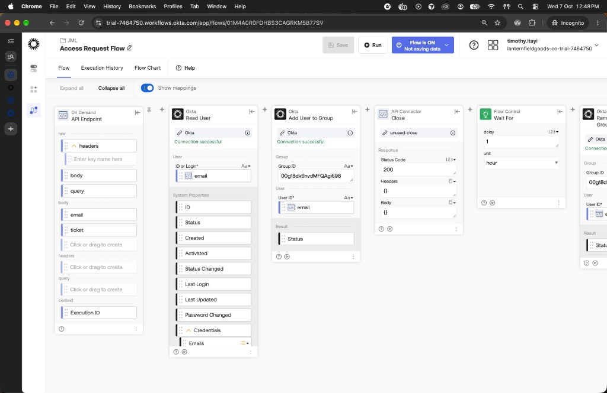
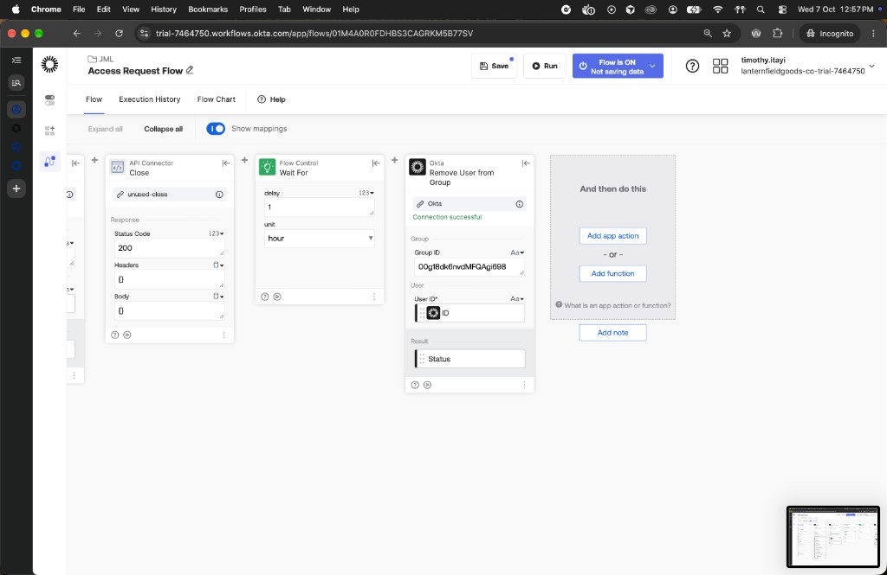

# Phase 5 — Governance

Previous: [Phase 4 — Joiner, mover, and leaver](04-jml.md).

osTicket is the ticket, not the provisioner. Staff login, the Access Request help topic, Lena Ortiz's `REQ-0001`, and the manager approval note are in place. The Access Request flow added her to `APP-Rostr-Admins` at 13:06 and removed her at 14:06:20. OIDC `/me` and `/admin/users` as Lena worked at 13:19–13:23. Ticket `357784` is still Open. Access review REQ-0002 applied at 13:43. Stale-Access planted Jonah Hale. OAuth review revoked `legacy-report-tool`. The audit pack and the OIG mapping are written.

Login pain is [docs/incidents/01-osticket-staff-login.md](../incidents/01-osticket-staff-login.md). osTicket is `rinkp/osticket-dockerized:1.18.4` on `127.0.0.1:8080`, leftover volume from 29 September, not this repo's compose.

## 5.1 osTicket Access Request ticket

Lena Ortiz, EMP-1005, asked for `APP-Rostr-Admins` for one hour. Marcus Bell, EMP-1004, is her manager. Mail is not configured, so the approval is an Internal Note from Admin, not a message Marcus received.

| Step | Clock (Sydney) | Evidence |
| --- | --- | --- |
| Staff `/scp` as Admin | 12:15 | [evidence/5.1-osticket-staff-login.png](../../evidence/5.1-osticket-staff-login.png) |
| Help topic `Access Request`, Active, Public, Support | 12:24 | [evidence/5.1-osticket-help-topics.png](../../evidence/5.1-osticket-help-topics.png) |
| Open ticket `357784`, subject `REQ-0001 APP-Rostr-Admins`, From Lena Ortiz | 12:27 | [evidence/5.1-osticket-ticket-list.png](../../evidence/5.1-osticket-ticket-list.png) |
| Thread: Lena's request, then Internal Note recording Marcus's approval | 12:28 | [evidence/5.1-osticket-approval.png](../../evidence/5.1-osticket-approval.png) |

osTicket timestamps on those screens are 1:24–1:28, which is UTC in the container. The screenshot files are 12:24–12:28 +1100.

The ticket is Open, unassigned, Help Topic Access Request, user `lena.ortiz@lanternfieldgoods.co.uk`. The lab id is `REQ-0001`. osTicket's number is `357784`. Leave it Open until she is in the group and, one hour later, out of it. Then Internal Note that it was revoked, then Close.

`hr-sync` is not used. `hr/employees.json` does not change.

## 5.2 Access Request flow

Saved, Flow ON, **Not saving data**. It adds the user to `APP-Rostr-Admins`, returns HTTP 200, waits one hour, then removes them. It does not update the Okta profile. It does not assign the Rostr Admin app as an Individual. `hr-sync` does not call it.

A first POST returned 404 from Add User to Group: the flow was ON but the canvas still had body `email` on User ID and had not been saved. After Save, a second POST at about 13:06 returned HTTP 200 `{}`. `hr-sync --ticket REQ-0001` dry-run reported `no changes`; that is expected.

| Event | Time (Sydney) | Evidence |
| --- | --- | --- |
| `group.user_membership.add` SUCCESS, actor Timothy Itayi (Workflows Okta connection), target Lena Ortiz / `APP-Rostr-Admins` | 13:06:18 | [evidence/5.2-system-log-group-add.png](../../evidence/5.2-system-log-group-add.png) |
| Group Push of that membership to Rostr | 13:06:18 | same log |
| Lena in `APP-Rostr-Admins`, Active, Managed Manually | 13:07 | [evidence/5.2-lena-in-app-rostr-admins.png](../../evidence/5.2-lena-in-app-rostr-admins.png) |
| Incognito `/oidc/login` as Lena, `/me` shows `aud` `0oa18egjva6o5FpoP698`, `sub` `00u18dk3t6entw6Kv698`, `groups` `APP-Rostr-Users, APP-Rostr-Admins` | 13:19 | [evidence/5.2-lena-oidc-me.png](../../evidence/5.2-lena-oidc-me.png) |
| Same session, `/admin/users` renders the Rostr users table | 13:23 | [evidence/5.2-lena-admin-users.png](../../evidence/5.2-lena-admin-users.png) |

Group membership was not enough to open the OIDC app until Rostr Admin was assigned to `APP-Rostr-Admins`. That group assignment is now on the app at priority 1: [evidence/5.2-rostr-admin-group-assignment.png](../../evidence/5.2-rostr-admin-group-assignment.png). An Individual assignment of Lena was used to get `/oidc/login` working. Remove that People row if it is type Individual. Do not unassign the group, and do not take her out of `APP-Rostr-Admins`. Wait For only removes the group membership. An Individual row would survive the revoke.

OIDC does not write `lastLogin`. Lena's row stayed empty. Jonah Hale's SAML time `2026-10-06T05:20:26.829Z` is unchanged. Samir Adeyemi and `test.joiner` are `active` no. Orphan Roster is still in the table.

The 13:06 POST is the only trigger. Do not POST again. Wait For fired: `group.user_membership.remove` for Lena / `APP-Rostr-Admins` is at `2026-10-07T03:06:20.435Z` (14:06:20 Sydney) in [evidence/audit-pack/system-log-group-membership.jsonl](../../evidence/audit-pack/system-log-group-membership.jsonl). Actor is the Workflows connection (display name Timothy itayi, IP `35.82.175.79`). The ticket is still Open until the History URL is pasted and it is Closed.

## 5.2 Close-out (not done)

Done when grant-after-approval and automatic remove show in all three records: ticket `357784`, Workflows History for the 13:06 run, System Log add and remove.

The flow is **Not saving data**, same as Leaver. History will have the execution row and not the card outputs. That row's URL is still the run link. Copy it from Workflows → this flow → History. The 13:06 run should still be in progress until Wait For ends.

After ~14:06, in this order:

1. System Log: `group.user_membership.add` at 13:06:18 (already shot) and `group.user_membership.remove` for Lena / `APP-Rostr-Admins`. Same actor as the add.
2. Directory: Lena not in `APP-Rostr-Admins`. Rostr sqlite and SCIM should drop her from that group.
3. New private window, `/oidc/login` as Lena, then `/admin/users`. Expect 403 (`Not allowed.`) if she can still sign in, or Okta refusing the app if group assignment is the only grant.
4. osTicket `357784`, Internal Note, then Close. Note text: `REQ-0001` granted 13:06, removed automatically after one hour, paste the History run URL. Do not Close before the remove event exists.
5. Save: History (completed run), System Log remove, ticket Closed with that note.

| Evidence still needed | File |
| --- | --- |
| Workflows History, this run | `evidence/5.2-flow-history.png` |
| `group.user_membership.remove` | `evidence/5.2-system-log-group-remove.png` |
| Ticket Closed, note has the run link | `evidence/5.2-ticket-closed.png` |

`APP-Rostr-Admins` group id `00g18dk6nvdMFQAgi698`. Close uses a dummy API Connector connection named `unused-close` with auth None, because Workflows stuffed Close under API Connector.

| Card | What it does |
| --- | --- |
| API Endpoint | Body `email`, `ticket`. |
| Read User | `User or Login` = body `email`. |
| Add User to Group | Group id above. User ID = Read User **ID** (System Properties). |
| Close | Status 200, empty body. Lets the caller return before the wait. |
| Wait For | Delay 1, unit hour. |
| Remove User from Group | Same group id. User ID = Read User **ID**. |

Do not copy a `00u` from Directory. Read User's input is labelled **User or Login**, so body `email` is legal there. Add and Remove are labelled **User ID**. Drag the **ID** output under Read User System Properties onto those two fields. A first canvas had body `email` on Add/Remove User ID; that is the wrong pill.





The invoke URL is `WORKFLOWS_ACCESS_REQUEST_URL`. The client token is `WORKFLOWS_ACCESS_REQUEST_TOKEN`, this flow's token, not the Joiner token. Neither value is in Git. Fulfilment is a POST to that endpoint, not `hr-sync`.

## 5.3 Access review

The runbook lists this as 5.2. This repo already used 5.2 for Access Request.

`scripts/access-review` is a script, not a flow. It reads every Rostr sqlite user, joins HR for manager, Okta for groups, and the System Log for last `user.authentication.sso` against the SAML Rostr app `0oa18eddmjpNG4dNI698` or the OIDC app `0oa18egjva6o5FpoP698`. It writes one CSV per manager with an empty `decision` column.

```
node scripts/access-review export --out evidence/5.3
node scripts/access-review apply --in evidence/5.3 --ticket REQ-0002
node scripts/access-review apply --in evidence/5.3 --ticket REQ-0002 --apply
```

Dry-run is the default. `--apply` removes the user from `APP-Rostr-Users` and `APP-Rostr-Admins` only. `svc-jml-sync` has no `okta.apps.manage`, so it cannot unassign the app. It does not touch `DEPT-` groups. The `DEPT-*` → `APP-Rostr-Users` rule would put an **active** staff member back. The two Revoke rows were leftover memberships on deprovisioned accounts, so the deletes stuck.

Export at 13:42: 10 Rostr rows, 5 files. Last Rostr SSO: Jonah Hale `2026-10-06T06:35:49.117Z`, Lena Ortiz `2026-10-07T02:19:24.525Z`. Everyone else empty. Assignment source is `group` where `APP-Rostr-*` is present, `none` for Orphan Roster (no Okta user).

| File | Who decides | Rows | Decision |
| --- | --- | --- | --- |
| [ava-nguyen.csv](../../evidence/5.3/ava-nguyen.csv) | Ava Nguyen | Jonah Hale | Keep |
| [marcus-bell.csv](../../evidence/5.3/marcus-bell.csv) | Marcus Bell | Lena, Priya, Thomas | Keep |
| [helen-cho.csv](../../evidence/5.3/helen-cho.csv) | Helen Cho | Samir Adeyemi | Revoke |
| [no-manager.csv](../../evidence/5.3/no-manager.csv) | Department heads | Ava, Helen, Marcus | Keep |
| [unmanaged.csv](../../evidence/5.3/unmanaged.csv) | Not in HR | Orphan Roster Keep, `test.joiner` Revoke | mixed |

Lena stayed Keep. Her `APP-Rostr-Admins` grant is the in-flight Access Request.

Apply REQ-0002 at `2026-10-07T02:43:27.024Z` (13:43 +1100). Both deletes HTTP 204. Log: [evidence/5.3/revocation.csv](../../evidence/5.3/revocation.csv). A second dry-run then reported `(no APP-Rostr group)` for both. Rostr sqlite still listed Samir in `APP-Rostr-Users` immediately after; group push is not the review's apply path.

## 5.4 Stale-Access

A script, not a fifth Workflows flow. Design still forbids changing the HR file or deactivating anyone. A daily Workflows schedule would only invoke this.

```
node scripts/stale-access plant
node scripts/stale-access --out evidence/05-governance/stale-access.md
```

Plant backdated Jonah Hale's Rostr `lastLogin` from `2026-10-06T05:20:26.829Z` to `2026-08-22T05:20:26.829Z` (−45 days) and set `licensed` 1 on Jonah and Orphan Roster. Rostr never writes `licensed`; without that mark the unused-licence count is zero.

Findings: [evidence/05-governance/stale-access.md](../../evidence/05-governance/stale-access.md). One stale lastLogin: Jonah Hale, licensed, **reclaim**. Two unused licences: Jonah (stale) and Orphan (not in HR). HR active 7, Rostr active 8, licensed seats 2. Lena's OIDC `/admin/users` did not write `lastLogin`, so she shows as never signed in on this report. That is a Rostr gap, not a missing Okta SSO.

## 5.5 OAuth review

Runbook: [docs/runbooks/oauth-review.md](../runbooks/oauth-review.md). Script: `scripts/oauth-review`.

**Problem 1:** `GET /api/v1/apps` 403. Requesting `okta.apps.manage` did not fail; Okta omitted it from the token.

**Fix 1:** Grant `okta.apps.manage` on `svc-jml-sync` › Okta API Scopes, assign Application Administrator. Token then included the scope. `/apps` 200.

**Problem 2:** Plant created `legacy-report-tool` `0oa18g5mzseAfusVa698`. `POST /apps/{id}/grants` 403. Super Administrator without `okta.appGrants.manage` still 403. Role and scope are separate. `okta.apps.manage` does not cover grants.

**Fix 2:** Grant `okta.appGrants.manage` and `okta.appGrants.read`. Token then included both. `GET /grants` 200. Super Admin stayed on for the review.

Found: [evidence/5.5/oauth-review-found.md](../../evidence/5.5/oauth-review-found.md). Four manage scopes on an unrecorded service app. After revoke: [evidence/5.5/oauth-review.md](../../evidence/5.5/oauth-review.md). Grants DELETE 204 × 4, deactivate HTTP 200. Disposition: grants revoked, deactivated.

Take Super Administrator off `svc-jml-sync` now. Leave Application Administrator and the apps/grants scopes if a later review needs them, or drop grants scopes if you want the app back to users/groups/logs only.

## 5.6 Audit pack

`evidence/audit-pack/` holds what an auditor would ask for. Each file is indexed to SOC 2 CC6.1–CC6.3 and ISO 27001:2022 A.5.15–A.5.18, A.8.2, A.8.5.

```
node scripts/audit-log-export.js --out evidence/audit-pack
```

That script pulls System Log by event family (`user.lifecycle.*`, `group.user_membership.*`, `application.user_membership.*`, `user.mfa.factor.*`), redacts secrets, and writes JSONL plus a count summary. The log API allows 60 requests a minute. Two overlapping runs sat on 429 until they were killed. A single run at 15:00 returned 27 lifecycle, 29 group, 46 app, and 61 MFA events. Okta sends a next link on the last page; the script stops when that page is empty.

| Subfolder | Contents | Control |
| --- | --- | --- |
| (root) | System Log JSONL, counts CSV | CC6.1–CC6.3 |
| `access-request/` | REQ-0001 timeline and screenshots | CC6.3 / A.5.18 |
| `access-review/` | Manager CSVs and revocation log | CC6.3 / A.8.2 |
| `stale-access/` | Findings and plant data | CC6.3 / A.8.2 |
| `oauth-review/` | Before and after integration tables | CC6.2 / A.8.5 |

Index: [evidence/audit-pack/README.md](../../evidence/audit-pack/README.md).

## 5.6 OIG mapping

Runbook task 5.6. The audit pack above is runbook 5.5. This repo already used 5.5 for the OAuth review, so the pack is filed under the heading before this one.

Done. The note is [docs/decisions/oig-mapping.md](../decisions/oig-mapping.md). Sources are Okta's Identity Governance, Access Requests, Access Certifications, and Entitlement Management pages. This trial does not include OIG. The note is how the product would do the lab's hand work. It is not a compliance claim.

| Lab process | How OIG does it | What OIG adds |
| --- | --- | --- |
| Birthright via HR, Joiner, group rules | Entitlement policy on the app, from profile or Okta-sourced group | Policy vs Custom recorded. Preview before apply. |
| `REQ-0001`: osTicket note, Workflows add, wait, remove | Access request condition: who, how long, approval sequence | Named approver, time box, catalog request, request history |
| `scripts/access-review` CSV, then DELETE | Certification campaign, or a security access review | Reviewer UI, auto-revoke, campaign report |
| Stale-Access report, no deactivate | Usage in a campaign; Analyzer last-use | Okta SSO last-use, scheduled revoke |
| Two groups as the only entitlements | Entitlements, bundles, collections, owners | Values finer than a group. Source labelled. |

Checkpoint: for any staff member, who approved their access? Birthright has no named approver. The Keep on REQ-0002 is the approval of record. Lena's `APP-Rostr-Admins` hour was approved by Marcus Bell. The flow removed it at 14:06:20. The System Log actor is Workflows, not Marcus. Ticket `357784` is still Open.

What to learn first on the job is in the mapping note: conditions before request types, campaign scope and auto-revoke, Policy vs Custom vs Bundle, and whether the org bought OIG at all.
