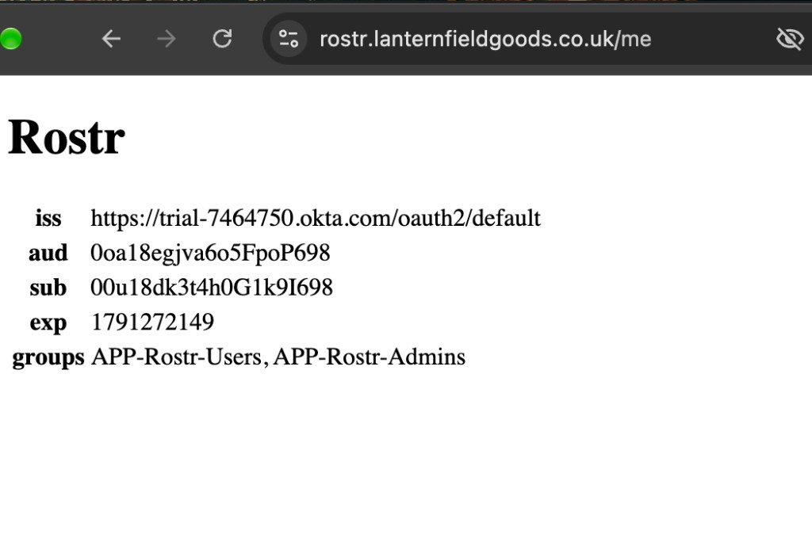
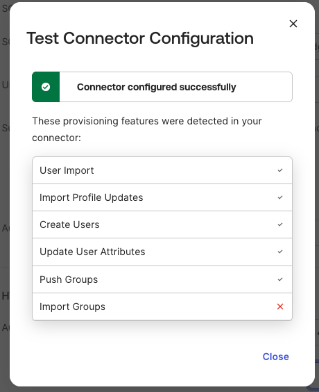
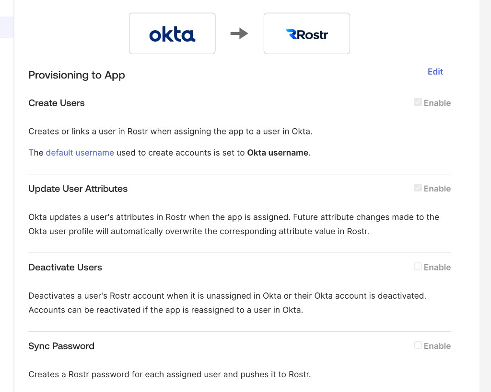

# Lanternfield Goods — Okta IAM lab report

Previous: [Leaver leaves Rostr active](incidents/07-leaver-downstream.md).

Date: 2026-10-07. This is a learning lab, not production Okta experience. Every claim below points at a file in this repository. The PDF at the repo root is an export of this page. Tasks 7.3 and 7.4 are not done: the CV notes are not in the repo, and the org has not been torn down.

## Purpose

The lab is a fictional retailer, Lanternfield Goods, with an HR file in Git, an Okta org, and a mock rostering app called Rostr. The point is to practise the operational work of an identity engineer: day-to-day Okta administration, SAML and OIDC onboarding, SCIM provisioning, joiner-mover-leaver automation, and the audit evidence those produce.

The design is [docs/decisions/02-design.md](decisions/02-design.md). The session record is [docs/worklog/week-1.md](worklog/week-1.md).

## How it was built

The domain is `lanternfieldgoods.co.uk`, not the `.com` name in the runbook. Cloudflare Email Routing receives mail and does not send it. Rostr's public name is `rostr.lanternfieldgoods.co.uk`, a named Cloudflare Tunnel to the container on port 3000. The tunnel credentials are outside the repo. [docs/decisions/00-domain.md](decisions/00-domain.md).

The org is `trial-7464750`, a 30-day Workforce Identity free trial. It is not the Integrator Free Plan the design assumed. Lifecycle Management on this trial ends when the 30 days end. The 10-active-user cap and the five-Workflow cap were kept anyway. [docs/decisions/01-org.md](decisions/01-org.md).

Two administrator accounts exist. The daily admin does the work. Break-glass is a separate Super Administrator with its own authenticator, created before the staff policies. [docs/decisions/02-break-glass.md](decisions/02-break-glass.md).

Staff, department group rules, the sign-on policy, the help desk role, and the MFA reset are Phase 1. [docs/phases/01-foundation.md](phases/01-foundation.md). [docs/runbooks/mfa-reset.md](runbooks/mfa-reset.md).

Rostr is the app in `rostr/`. Staff sign in with SAML. Administrators sign in to `/admin/users` with OIDC. That page requires `APP-Rostr-Admins` in the `groups` claim. [docs/phases/02-onboarding.md](phases/02-onboarding.md).

Okta provisions Rostr over SCIM 2.0 at `https://rostr.lanternfieldgoods.co.uk/scim/v2`. The app sends PUT for updates, including deactivation. It does not send DELETE for users. [docs/phases/03-scim.md](phases/03-scim.md).

`scripts/hr-sync` diffs `hr/employees.json` against `HEAD~1`, classifies a joiner, mover, or leaver, and does not call Okta unless `--apply` is passed. The Joiner, Mover, and Leaver Workflows do the Okta writes. Group rules fill `DEPT-*` and `APP-Rostr-Users`. SCIM then writes Rostr. Phase 4 created Thomas Okeke, moved Priya Shah to Operations, and deactivated Samir Adeyemi. [docs/phases/04-jml.md](phases/04-jml.md). The service app is `svc-jml-sync`, private key outside the repo, DPoP required. [docs/decisions/scripts-identity.md](decisions/scripts-identity.md).

Phase 5 is osTicket for the request, an Access Request Workflow that added Lena Ortiz to `APP-Rostr-Admins` and removed her an hour later, an access review, a stale-access script, an OAuth grant review, and an evidence pack mapped to SOC 2 and ISO 27001 control names. This org does not have Okta Identity Governance. The mapping note is not a compliance claim. [docs/phases/05-governance.md](phases/05-governance.md). [docs/decisions/oig-mapping.md](decisions/oig-mapping.md). [evidence/audit-pack/README.md](../evidence/audit-pack/README.md).

Phase 6 broke six things on purpose and put each one back. [docs/incidents/](incidents/).

Code in this repo was drafted with Cursor and reviewed before it was committed. Okta configuration, the tests, and these write-ups were done in the org.

## Why

The design was written down before the clicking, because the user cap and the flow cap are real. Email is the username because Okta login, the SAML NameID, and the Rostr sign-in upsert are all the email. Okta's own guide advises against that. The lab kept it so the three identifiers stay the same, and recorded the trade-off. [docs/phases/03-scim.md](phases/03-scim.md).

Apps are assigned to groups. Department groups are filled by rules. A membership added by hand does not follow a department change. Drill 6.5 is that fact, not a surprise. [docs/incidents/06-mover-residue.md](incidents/06-mover-residue.md).

Stale-Access is a script rather than the fifth Workflow. The flow budget was already spent on Joiner, Mover, Leaver, and Access Request. A script can be re-run and diffed. A fifth flow could not be created without deleting one of those four.

## Risk management

| Risk | What the lab actually did |
| --- | --- |
| Rostr is on the internet while the tunnel is up | SCIM requires a bearer token. A missing or wrong token is 401. The data is fictional. [docs/phases/03-scim.md](phases/03-scim.md) |
| A secret in Git | `.gitignore` and `.cursorignore` block `.env` and keys. `.env.example` has names only. The service private key is under the home directory. [docs/decisions/scripts-identity.md](decisions/scripts-identity.md) |
| Locked out of the org | Break-glass is a separate super admin. [docs/decisions/02-break-glass.md](decisions/02-break-glass.md) |
| Automation too powerful | `svc-jml-sync` has three scopes plus the app-grant scopes added for the OAuth review. Role and scope are separate. The review found a planted app and revoked its grants. [docs/runbooks/oauth-review.md](runbooks/oauth-review.md) |
| A script changes the wrong person | `hr-sync` dry-runs unless `--apply` is passed, and it rejects a ticket that is not `REQ-` plus four digits. |
| The 10-user cap | Deactivated users do not count. Samir Adeyemi and Thomas Okeke are terminated in the HR file. Drill Scim was deactivated after 6.4. |
| The trial ends | This is a 30-day trial, not a 90-day idle Integrator org. Teardown has to decide what happens to the org before the trial converts. That decision is 7.4 and is not made here. |
| Over-claiming | This report does not say the lab administered a production org, owned a production lifecycle, or delivered a compliance programme. |

## Incidents

| Record | What broke | What fixed it |
| --- | --- | --- |
| [00](incidents/00-duplicate-rostr-admin.md) | Two OIDC apps named Rostr Admin | Kept `0oa18egjva6o5FpoP698`. Deleted the duplicate. |
| [01](incidents/01-osticket-staff-login.md) | osTicket staff login denied | The username was an md5 of an old email, and the password hash had to be bcrypt cost 8. |
| [02](incidents/02-saml-acs.md) | Single sign-on URL pointed at `/saml/acs2` | Browser stopped on `Cannot POST /saml/acs2`. The auth log gained no line. URL put back. |

| Record | What broke | What fixed it |
| --- | --- | --- |
| [03](incidents/03-oidc-redirect.md) | Sign-in redirect URI did not match the client | Okta returned 400 `invalid_request` before Rostr saw the callback. |
| [04](incidents/04-groups-claim.md) | `groups` filter was `APP-Rostrx` | Sign-in succeeded and `/me` showed no groups. Filter put back. |
| [05](incidents/05-scim-mapping.md) | Create required department, and the mapping was removed | Okta's retry returned 201 with no department. A later profile edit pushed `Sales`. Deactivation then set Rostr inactive. |
| [06](incidents/06-mover-residue.md) | Jonah was in `APP-Rostr-Admins` by hand, then moved to Operations | The department rules moved. The manual grant stayed until it was removed. |
| [07](incidents/07-leaver-downstream.md) | Deactivate Users was off | Thomas was `DEPROVISIONED` in Okta and still active in Rostr. The checkbox was turned back on, he was activated, and the second deactivate wrote `active: false`. |

The 6.1 success sign-in overwrote Jonah's planted stale `lastLogin`. The Phase 5 stale-access report no longer matches the database. [docs/incidents/02-saml-acs.md](incidents/02-saml-acs.md).

## Outcome

| The lab is done when | State on 2026-10-07 |
| --- | --- |
| One HR source drives joiner, mover, and leaver | Done. Thomas created, Priya moved, Samir deactivated. A second leaver on Samir changed nothing. [docs/phases/04-jml.md](phases/04-jml.md) |
| SAML and OIDC can be explained from captures | Done. Jonah completed both. [docs/phases/02-onboarding.md](phases/02-onboarding.md) |
| SCIM shows create, update, and deactivate | Done. The app sends PUT, including `active: false`. [docs/phases/03-scim.md](phases/03-scim.md) |
| Group and attribute mappings are tested | Done, with a gap: a failed create's retry did not re-read a mapping that was fixed afterwards. The profile edit did. [docs/incidents/05-scim-mapping.md](incidents/05-scim-mapping.md) |
| An access request and a review | The grant and the hour-later remove are in the System Log. Ticket `357784` is still Open. REQ-0002 revoked leftover group membership. [docs/phases/05-governance.md](phases/05-governance.md) |
| An evidence pack | [evidence/audit-pack/README.md](../evidence/audit-pack/README.md) |
| Six deliberate failures written up | Done. Incidents 02 through 07, plus the two earlier incidents. |
| Teardown | Not done. |

Current HR file, which is ahead of the Phase 4 story: Jonah Hale is Operations, Priya Shah is Operations, Samir Adeyemi is terminated, Thomas Okeke is terminated. `APP-Rostr-Admins` is empty. An orphan row inserted straight into Rostr was imported, matched nobody, and was ignored. It is still in the database. [docs/phases/03-scim.md](phases/03-scim.md).

## What production would add

A real HRIS, not a JSON file. Okta Identity Governance for requests, certifications, and entitlements, instead of osTicket plus a Workflow plus a script. Device trust, which this lab did not build because it needs managed devices.

The Mover flow updates the profile and reads groups. It does not remove a membership that was added by hand. Production would have to decide whether that cleanup lives in the flow, in a review, or in a rule that forbids manual members of `APP-*` groups.

Deactivate Users has to stay on. Turning it off does not fail the Okta deactivation. It fails the app account, quietly, which is what 6.6 showed.

`userName` would not be the email if addresses change. This lab used the email on purpose.

The trial org, the open ticket, the ignored orphan, and the stale-access report that no longer matches `lastLogin` would not be left as the record of the directory. Teardown, or a renewal decision, is still outstanding.
